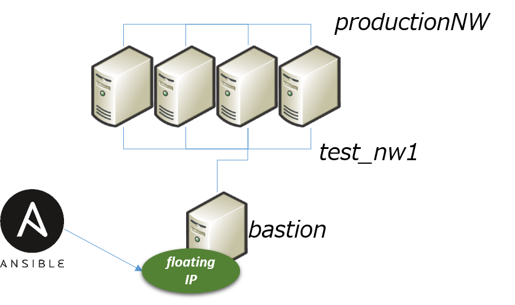

# openstack_modified.py
A Dynamic inventory script for ansible to use with OpenStack.

I modified [original file](https://raw.githubusercontent.com/ansible/ansible/devel/contrib/inventory/openstack.py) so that I can specify which network IP to be returned.

I'm using this script to configure 5VMs from backend network with 1 flaotingIP.

Please refer to bastion ansible model for further reading.



### How to use
Following command returns private ips assigned to `test_nw1`.
```
openstack_modified.py --list --private --specific_network test_nw1
```
